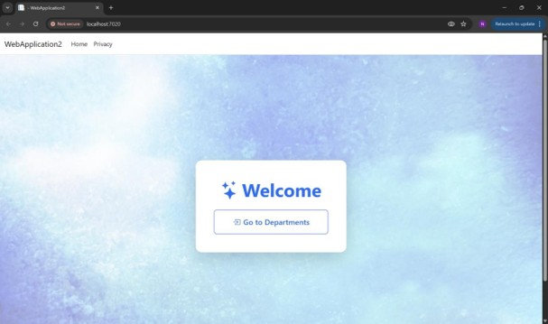
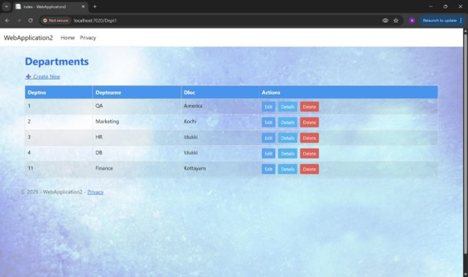
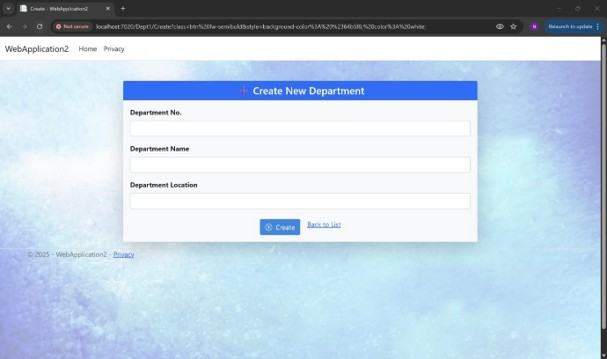
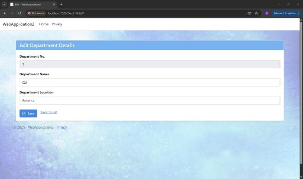
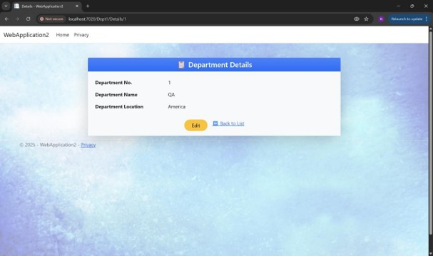
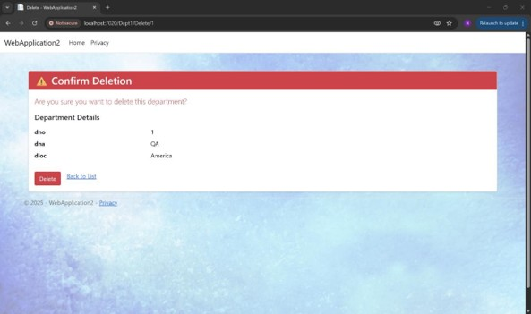

# 👨‍💼 Employee Management System

A web-based Employee Management System developed during my internship at **MariApps Marine Solutions Pvt. Ltd.** The application enables users to efficiently manage employee records through Create, Read, Update, and Delete (CRUD) operations using the ASP.NET Core MVC framework.

> **Note:** This project was developed as part of my internship training. The source code is not publicly available.

---

## 🚀 Features

- 👥 Add new employee records
- 📋 View employee details
- ✏️ Edit existing employee information
- 🗑️ Delete employee records
- 🔍 View detailed employee information
- ✅ Form validation
- 🗃️ SQL Server database integration

---

## 🛠️ Tech Stack

- C#
- ASP.NET Core MVC (.NET 8)
- ADO.NET
- SQL Server
- HTML5
- CSS3
- Bootstrap
- Visual Studio 2022

---

## 💡 My Contributions

During my internship at **MariApps Marine Solutions**, I:

- Developed CRUD operations using ASP.NET Core MVC.
- Connected the application with SQL Server using ADO.NET.
- Implemented business logic and server-side validation.
- Designed Razor Views for user interaction.
- Worked with the MVC architecture and layered design.
- Debugged and tested application functionality.

---

## 📸 Application Screens

### 🏠 Home Page

---

### 📋 Employee List

---

### ➕ Create Employee

---

### ✏️ Edit Employee

---

### 📄 Employee Details

---

### 🗑️ Delete Employee

---

## 📌 Project Highlights

- Complete CRUD Operations
- SQL Server Database Integration
- MVC Architecture
- Layered Architecture
- Razor Views
- Form Validation
- Clean and Responsive User Interface

---

## 🏢 Internship Project

This project was developed during my internship at **MariApps Marine Solutions Pvt. Ltd.** as part of the internship training program. It helped me gain practical experience in enterprise application development using the Microsoft .NET ecosystem.

---

## 📚 Key Learning Outcomes

- ASP.NET Core MVC Framework
- ADO.NET Database Connectivity
- SQL Server Management
- MVC Design Pattern
- Razor View Engine
- Enterprise Software Development
- Debugging and Testing
- Version Control with Git

---

## 🔒 Source Code

The source code is **not publicly available**, as this project was developed during my internship training.

