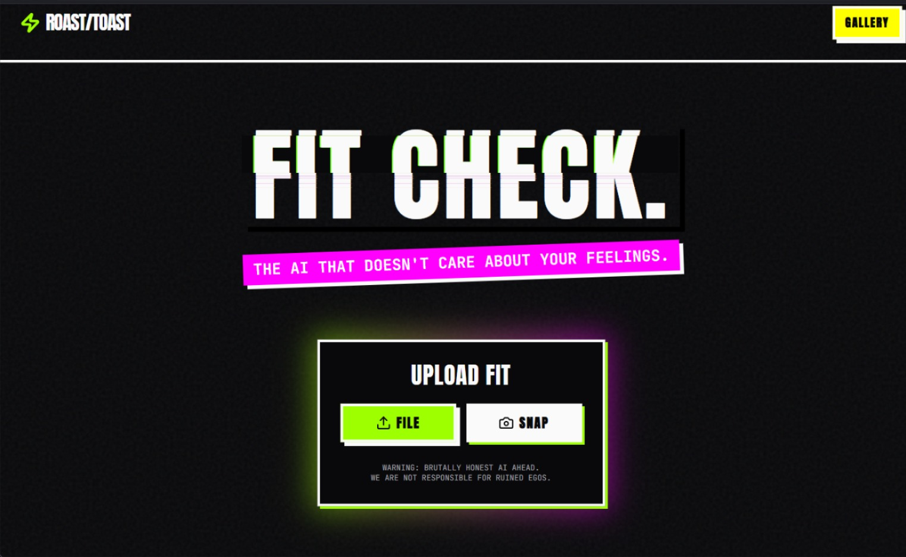
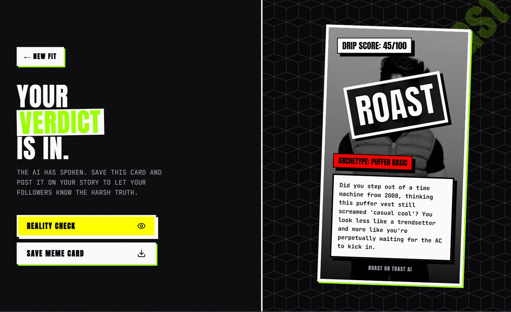

# 🔥 Roast or Toast (DripCheck)

Roast or Toast is an AI-powered outfit analyzer that evaluates fashion choices using the Google Gemini Vision API. Users can upload an outfit image and receive an AI-generated style analysis, including a drip score, style archetype, strengths, weaknesses, and a fun "Roast or Toast" verdict.

---

## 🚀 Features

- 📸 Upload outfit images
- 🤖 AI-powered outfit analysis
- 📊 Drip Score (0–100)
- 👔 Style Archetype Identification
- 🔥 Roast or Toast Verdict
- 🖼️ Shareable meme generation

---

## 🛠️ Tech Stack

- Python
- FastAPI
- HTML
- CSS
- JavaScript
- Google Gemini Vision API
- Pillow (PIL)

---

## 💡 My Contributions

Although this was a collaborative hackathon project, I contributed by:

- 💭 Brainstorming and idea generation
- 📝 Preparing project documentation
- 🧪 Testing application functionality
- 🤝 Collaborating with the team during development
- 🐞 Identifying issues and providing feedback for improvements

---

## 📸 Application Screens

### 🏠 Homepage

---

### 🤖 AI Analysis Page

---

## 📌 Project Highlights

- AI-powered fashion analysis
- Google Gemini Vision API integration
- Fun and engaging user experience
- Automatic meme generation
- FastAPI backend with responsive frontend

---

## 🤝 Team Project

This application was developed collaboratively during a hackathon.

My primary responsibilities included:

- Idea Generation
- Documentation
- Testing & Quality Assurance
- Team Collaboration

---

## 🔗 Source Code

👉 **[View Team Repository](https://github.com/navneetmohan/Dripcheck)**

