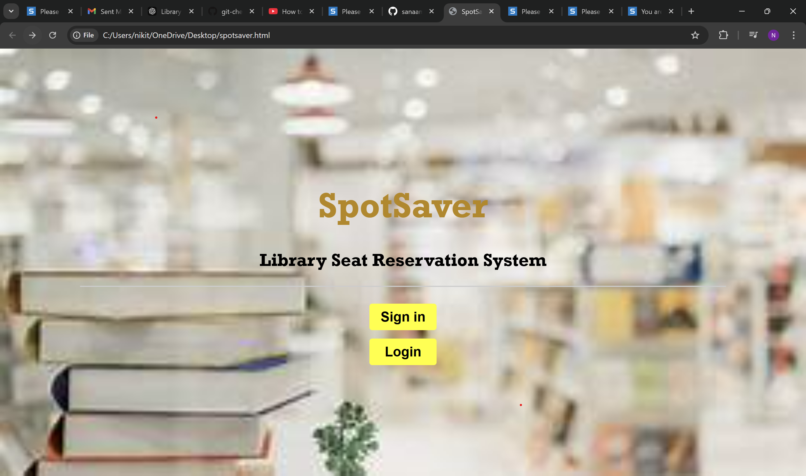
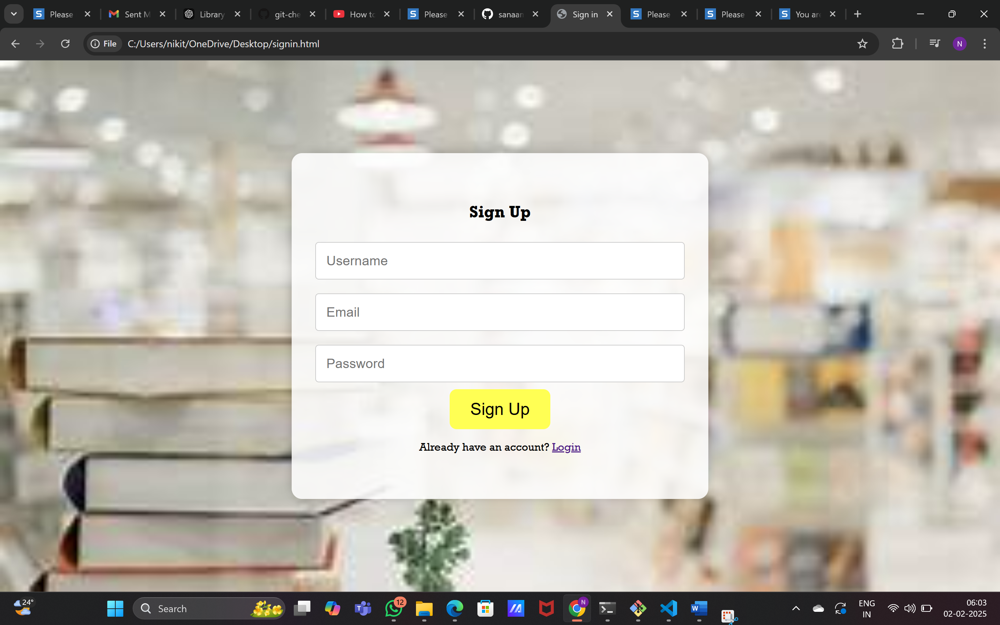
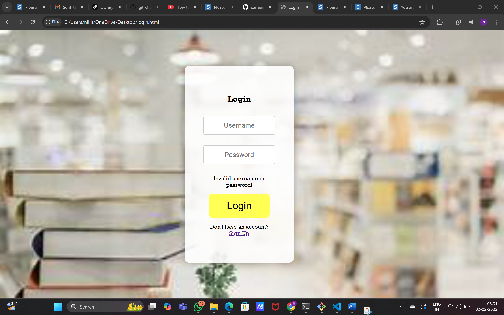
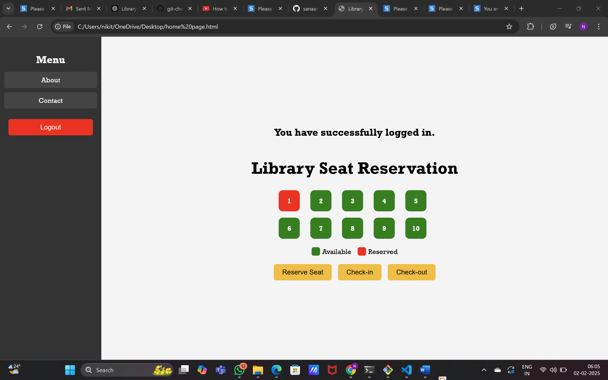

# 📚 SpotSaver – Library Seat Reservation System

SpotSaver is a web application designed to simplify library seat reservations during peak hours. It allows students to reserve available seats, check in/check out, and view seat availability in real time, helping reduce overcrowding and improve library management.

---

## 🚀 Features

- 👤 User Registration & Login
- 💺 Real-time Seat Reservation
- 🟢 Available Seats Display
- 🔴 Reserved Seats Display
- ✅ Check-in & Check-out
- 🚪 Secure Logout

---

## 🛠️ Tech Stack

- HTML5
- CSS3
- JavaScript

---

## 💡 My Contributions

- Developed the frontend using **HTML** and **CSS**.
- Designed responsive UI screens.
- Created the homepage layout.
- Styled the login and sign-up pages.
- Collaborated with the team during development and testing.

---

## 📸 Application Screens

### 🏠 Landing Page

---

### 📝 Sign Up

---

### 🔐 Login

---

### 💺 Home Page

---

## 📌 Project Highlights

- Easy seat reservation system
- Visual seat availability (Green = Available, Red = Reserved)
- User authentication
- Simple and responsive interface
- Designed for efficient library management

---

## 🌐 Live Demo

👉 **https://spotsaver-seven.vercel.app/**

Alternative Deployment:

👉 **https://spotsaver-sanaa-mariya-nisans-projects.vercel.app/**

---

## 🤝 Team Project

This application was developed collaboratively by **Team InnovateHers**.

### Team Members

- Aysha Nabeel
- **Nikitha Tom**
- Sanaa Mariya Nisan

### My Role

- HTML Development
- CSS Styling
- UI Design
- Frontend Development

---

## 🔗 Source Code

👉 **[View Team Repository](https://github.com/sanaamariya/tink-her-hack-3-InnovateHers)**
---

## 🎥 Project Demo

👉 **[Watch Demo Video](https://drive.google.com/file/d/1tGO0uCiK7G-e2AjPYZ-cv9uPzZHp07xc/view?usp=drive_link)**

