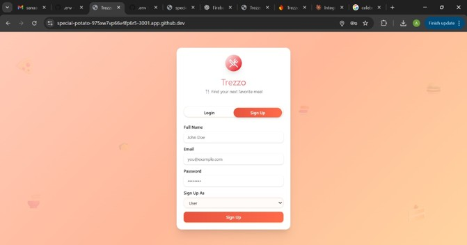
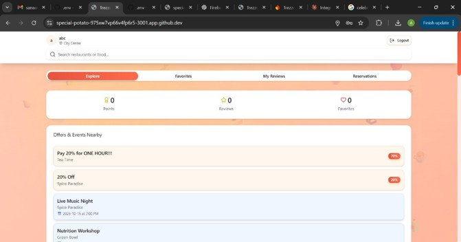
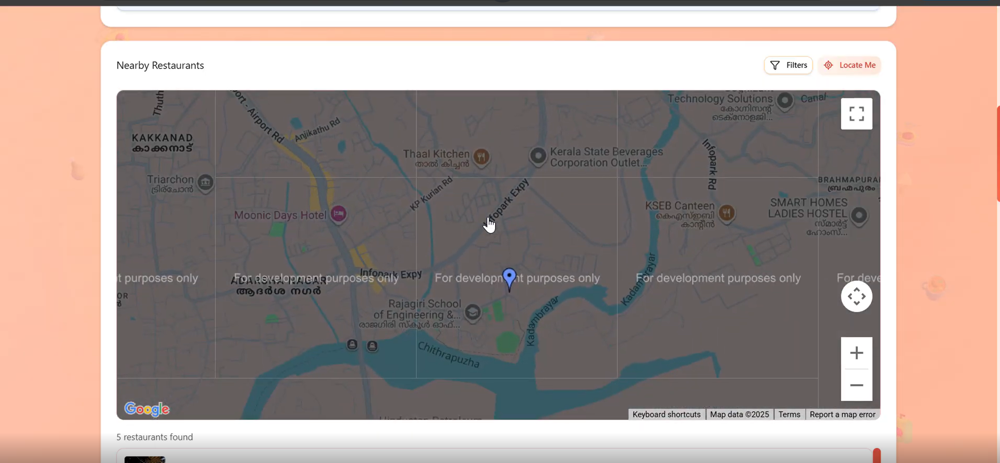
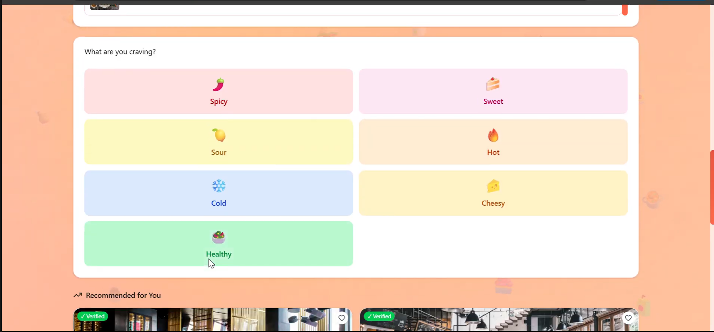
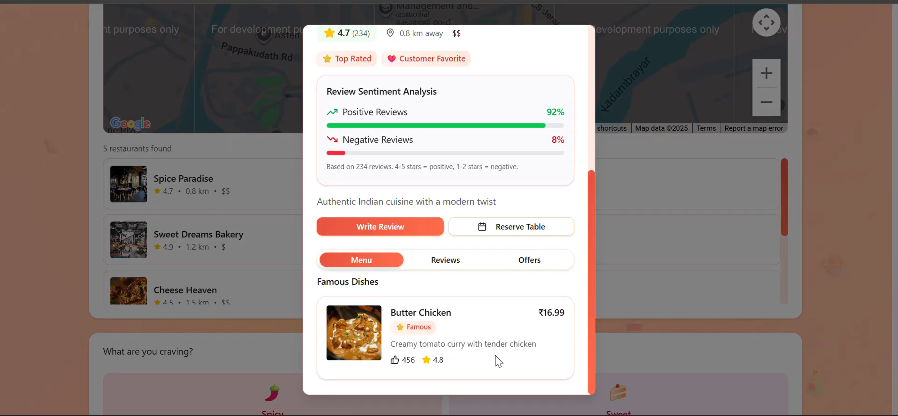
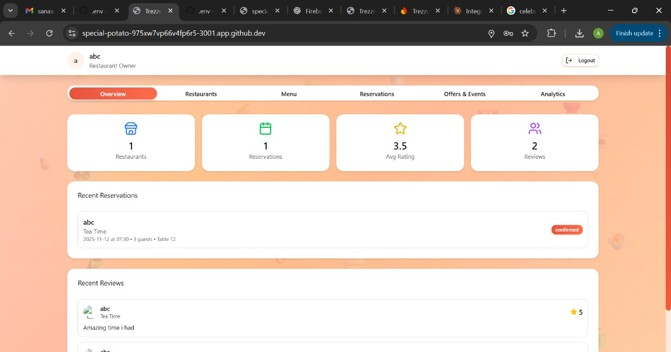
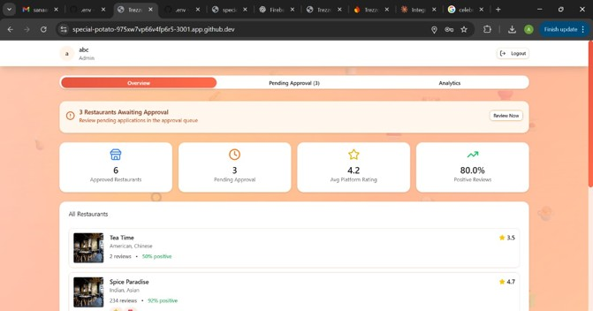

# 🍽️ Trezzo – Food Spot Locator

## Overview

Trezzo is a location-based mobile application that helps users discover nearby food spots. The application allows users to search restaurants, view detailed information, filter results based on preferences, and navigate using an interactive map. Restaurant owners can register and manage their listings through a dedicated dashboard.

## Tech Stack

- React Native
- Expo
- Firebase Authentication
- Cloud Firestore
- Google Maps API
- JavaScript

## My Contributions

- Developed user authentication.
- Integrated Firebase Authentication and Firestore.
- Implemented interactive map functionality.
- Developed restaurant search and filtering.
- Designed user interface screens.
- Contributed to dashboard development and testing.

## Key Features

- User Registration & Login
- Interactive Map
- Restaurant Search
- Advanced Filters
- Restaurant Details
- User Dashboard
- Owner Dashboard
- Admin Dashboard

---

## 📸 Application Screens

### 👤 User Registration

---

### 🏠 User Dashboard

---

### 🗺️ Interactive Map

---

### 🎯 Restaurant Filters

---

### 🍽️ Restaurant Details

---

### 🏪 Owner Dashboard

---

### 🛠️ Admin Dashboard

---

## 📌 Project Highlights

- 📍 Discover nearby restaurants
- 🔍 Search and filter food spots
- 🗺️ Interactive map navigation
- 👤 Separate dashboards for Users, Owners, and Admin
- 🔐 Secure authentication using Firebase
- ☁️ Cloud Firestore database integration

## Project Repository

This project was developed as part of a collaborative team project.

